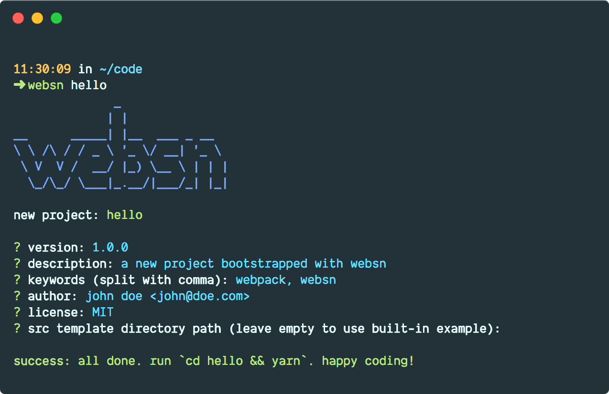

# websn [![npm version][npm-image]][npm-url] [![Build status][travis-badge]][travis-url] [![Known vulnerabilities][snyk-badge]][snyk-url] [![JavaScript Standard Style][standardjs-badge]][standardjs-url]

> An opinionated webpack configuration generator for traditional front-end
> development



websn is a [webpack][webpack] configuration generator for front-end development
and the spiritual successor to [rtsn][rtsn] (the name is an amalgamation of
_rtsn_ and _webpack_). The goal was to keep most of rtsn's features while
modernizing everything with webpack and keeping the configuration as simple as
possible, so even people who have never worked with webpack and/or are new to
front-end Web development before can pick it up.

Its focus is more on _traditional_ front-end development where you end up with
your HTML, CSS and JS split up into separate files. This makes it well suited
for CMS theme development (e.g., for [WordPress][wordpress]). However, the
configuration is also easily expandable for more modern style SPA development
with [Vue][vue] or other frameworks.

websn generates a webpack configuration that has a similar feature set as rtsn:

+ HTML beautification __or__ minification: the beautified HTML is a great
  starting point for CMS template files while the minified one is ideal for
  static sites.
+ [Sass/SCSS][sass] as CSS preprocessor: includes automated optimizations,
  autoprefixing and minification.
+ [Critical][critical] inline CSS: optimized above-the-fold rendering and great
  [PageSpeed][pagespeed] scores.
+ [Babel][babel] for transpiling ES6+ down to ES5: use the latest JavaScript
  features without having to worry about older browsers.
+ [Browserslist][browserslist] for automated browser version targeting: do not
  think about which CSS or JS features are supported in the browsers you target
  just write your JS using the latest ES6+ features and your CSS without any
  vendor prefixes – webpack will do the rest.
+ [imagemin][imagemin] for automatic image optimization.
+ Automatic copying of everything that does not need to be transformed: useful
  for fonts and other static assets.
+ Configurable copying from `node_modules`: makes it easy to use assets from
  installed packages without having to rely on loaders which will not work if
  the assets are not required anywhere in files processed by webpack. Ideal for
  CMS themes or other cases where you might have to incorporate files not
  handled by webpack.
+ [webpack-dev-server][webpack-dev-server] for automatic browser refreshing and
  [Hot Module Replacement][hot-module-replacement] during development.
+ Project bootstrapping with useful (dot)files.
+ Several configuration options to easily adjust input/output files/directories
  etc. without having to touch the webpack configuration at all.

The following features have purposefully been dropped in comparison to rtsn:

+ _[Pug][pug]_ support: with all the tools available in modern editors that
  make writing plain HTML easier and more comfortable than ever, Pug is not
  needed for simple templating anymore. And while it is still useful for
  generating static sites, this is not the main focus of websn.
+ _[Less][less]_ support: it does not really do anything better than Sass/SCSS
  but complicates things for people new to Web development by making them
  choose.
+ _[ngrok][ngrok]_ support: ngrok is a great tool and while I would have loved
  to include it, getting it to play nice with the dev server is a bit of a
  pain. It might make a comeback in a later release though!

## Table of contents

+ [Install](#install)
  + [Dependencies](#dependencies)
  + [Updating](#updating)
+ [Usage](#usage)
  + [CLI](#cli)
  + [Configuration](#configuration)
  + [Build](#build)
+ [Donate](#donate)
+ [Maintainer](#maintainer)
+ [Contribute](#contribute)
+ [License](#license)

## Install

websn should be installed globally to make it as easy to use as possible. This
guide focuses on using [Yarn][yarn] which is recommended due to its speed, but
[npm][npm] will also work.

```zsh
user@local:~$ yarn global add websn
```

### Dependencies

+ [Node.js][nodejs] (tested on `10.1.0`+)
+ [Yarn][yarn] (tested on `1.6.0`+)
  + __or__ [npm][npm] (tested on `6.0.0`+)

### Updating

Upgrading a globally installed version of websn is as easy as installing it:

```zsh
user@local:~$ yarn global upgrade websn
```

__Important:__ Updating the dependencies and configuration of existing projects
is currently not supported. In contrast to rtsn, websn has been designed to be
a tool to quickly get a project running and to not make it depend on it in the
future.

## Usage

### CLI

You can create a new project with websn using the following command:

```zsh
user@local:~$ websn <project name>
```

This will prompt you for some input (like you might already have seen when
using `npm init` or `yarn init`) and will then create your project in a new
directory (relative to your current directory, so make sure to always run websn
in the directory you want your project directory to be located in).

After websn has finished, simply switch to your new project directory and
install the dependencies to finish the setup:

```zsh
user@local:~$ cd <project name>
user@local:<project name>$ yarn install
```

A few other commands are available as well:

```zsh
user@local:~$ websn --help # prints information about using websn
user@local:~$ websn --version # prints the current version of websn
```

### Configuration

websn offers you to change some aspects of your development configuration
without having to touch webpack itself. You can find this configuration in
`<project name>/websn.config.js`.

This is mainly intended as a starting point for developers who are new to
webpack, so once you are familiar with it, feel free to start tinkering with
webpack itself.

The following options are available:

+ `input.base: "src"`: the base input directory. This is where your code is
  located.
+ `input.entry: "index.js"`: the entry file. This is where you need to
  require/import your JS/Sass/SCSS in order to process it with webpack.
+ `input.htmlFiles: ["index.html"]`: the HTML entry files. You can define as
  many as you need.
+ `input.styles: "styles"`: the directory where you Sass/SCSS is located.
  Important for a correct build process.
+ `output.base: "dist"`: the base output directory. This is where webpack will
  output your build to.
+ `output.styles: "css/site.css"`: the file your styles will be bundled into.
+ `output.scripts: "js/site.js"`: the file your JavaScript will be bundled
  into.
+ `style.minifiedHtml: true`: enables HTML minification on production builds.
+ `style.beautifiedHtml: true`: enables HTML beautification on production
  builds. Does not have any effect when `style.minifiedHtml` is enabled as well.
+ `style.criticalCss: false`: enables critical inline CSS on production builds.
  Currently only works with the first HTML entry file to not kill performance
  when there are a lot of entries.
+ `vendoryCopy: []`: files that should be copied from package directories under
  `node_modules`. As shown in the example that exists after installation, every
  instruction takes three properties: `from`, the package directory where you
  want to copy something from, `files`, a [glob pattern][glob] to match the
  files you want to copy, and `to`, the target directory relative to the
  configured `output.base`. Wrong instructions will usually not result in an
  error.
+ `devServer.port: 9000`: the port the dev server should be listening on.
+ `devServer.hot: true`: enables hot module replacement.
+ `devServer.open: true`: opens a browser tab once the dev server starts.
+ `devServer.overlay: true`: displays an overlay directly in the browser when
  there is an error.
+ `devServer.reloadOnChange: []`: defines the file types that should cause the
  dev server to restart when files are changed. The default file types should
  be a good starting point. File types that are handled via loaders
  (JS/Sass/SCSS) do not have to be included as the dev server can determine
  changes to them by default.

__Important:__ Make sure to restart the dev server after changing any settings.
It unfortunately cannot detect configuration changes while it is running.

### Build

Use the following command to make a new production build:

```zsh
user@local:<project name>$ yarn run build
```

And the following to start the dev server:

```zsh
user@local:<project name>$ yarn run serve
```

To stop the dev server, use <kbd>⌃ Control</kbd> <kbd>C</kbd>.

## Donate

If you like websn and want to buy me a coffee, feel free to donate via PayPal:

[![Donate via PayPal][paypal-image]][paypal-url]

Alternatively, you can also send me BTC:

![Donate BTC][btc]  
`13jRyroNn8QF4mbGZxKS6mR3PsxjYTsGsu`

Donations are unnecessary, but very much appreciated. :)

## Maintainer

[mserajnik][maintainer]

## Contribute

You are welcome to help out!

[Open an issue][issues] or submit a pull request.

## License

[MIT](LICENSE.md) © Michael Serajnik

[npm-url]: https://www.npmjs.com/package/websn
[npm-image]: https://img.shields.io/npm/v/websn.svg

[travis-url]: https://travis-ci.com/mserajnik/websn
[travis-badge]: https://travis-ci.com/mserajnik/websn.svg

[snyk-url]: https://snyk.io/test/github/mserajnik/websn
[snyk-badge]: https://snyk.io/test/github/mserajnik/websn/badge.svg

[standardjs-url]: https://standardjs.com
[standardjs-badge]: https://img.shields.io/badge/code_style-standard-brightgreen.svg

[websn]: screenshot.png
[webpack]: https://webpack.js.org
[rtsn]: https://github.com/mserajnik/rtsn
[wordpress]: http://en.wordpress.org
[vue]: https://vuejs.org/
[sass]: http://sass-lang.com
[critical]: https://github.com/addyosmani/critical
[pagespeed]: https://developers.google.com/speed/pagespeed/insights/
[babel]: https://babeljs.io
[browserslist]: https://github.com/browserslist/browserslist
[imagemin]: https://github.com/imagemin/imagemin
[webpack-dev-server]: https://webpack.js.org/configuration/dev-server/
[hot-module-replacement]: https://webpack.js.org/concepts/hot-module-replacement/
[pug]: https://pugjs.org
[less]: http://lesscss.org
[ngrok]: https://ngrok.com/
[nodejs]: https://nodejs.org/en/
[yarn]: https://yarnpkg.com/
[npm]: https://www.npmjs.com/
[glob]: https://en.wikipedia.org/wiki/Glob_(programming)

[paypal-url]: https://www.paypal.me/mserajnik
[paypal-image]: https://www.paypalobjects.com/webstatic/en_US/i/btn/png/blue-rect-paypal-26px.png
[btc]: https://mserajnik.at/external/btc.png

[maintainer]: https://github.com/mserajnik
[issues]: https://github.com/mserajnik/websn/issues/new
